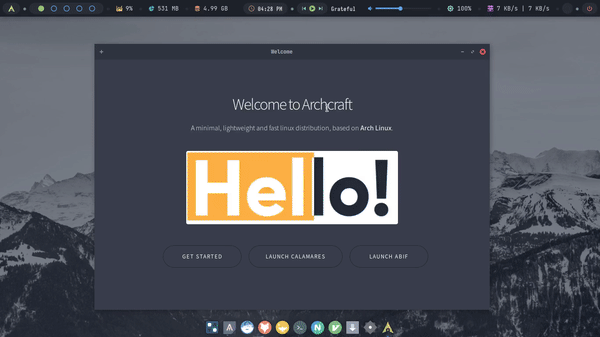

# **Archcraft installation**

<p align="center">
 
</p>

## **Installation of the Spatial ecosystem in Archcraft**

### Update SO and Keys

```
sudo pacman Syyu
sudo pacman-key --refresh-keys
```


### **1. QGIS Installation**
#### option 1:
```
sudo pacman -S qgis
```
#### option 2:

```
yay -S qgis-ltr 
```

#### DataPlotly Plugin
```
sudo pacman -S python-pip
pip install plotly
```

### SAGA installation

```
yay -S saga-gis
```

### GRASS GIS installation

```
yay -S grass-gis
```

### **2. Instalation of R & Rstudio** 

```
sudo pacman -Syyu
sudo pacman -S r rstudio-desktop
```
### **3. Installation of the r-spatial ecosystem**

```
cd /tmp
yay -G v8-r   
cd v8-r
makepkg -si
```
```
sudo pacman -S tk
```

```
sudo pacman -S gcc-fortran gdal proj geos
```
```
git clone https://aur.archlinux.org/udunits.git
cd udunits
makepkg -si
```

```
sudo pacman -S protobuf
```

### **4. Blender installation**

```
yay -S blender-git
```

### **5. VScode installation**

```
sudo pacman -S visual-studio-code-bin
```
### **6. Brave installation**

```
yay -S brave-bin
```
### **7. Exiftool installation**

```
sudo pacman -S perl-image-exiftool
```
### **8. WSP office installation**

```
sudo pacman -S wsp-office
```
### **9. Knsip and Inkscape**

```
sudo pacman -S knsip inkscape
```

### References 

- https://wiki.archcraft.io/docs/intro
- https://wiki.archlinux.org/
